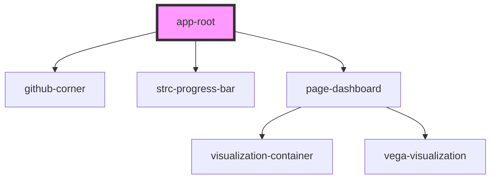

# app-root

<!-- Auto Generated Below -->

## Properties

| Property           | Attribute | Description                        | Type         | Default     |
| ------------------ | --------- | ---------------------------------- | ------------ | ----------- |
| `coeffs`           | --        | The wavelet coefficients.          | `number[][]` | `undefined` |
| `interpTimeSeries` | --        | The interpolated time series data. | `Point[]`    | `undefined` |
| `timeSeries`       | --        | The time series data.              | `Point[]`    | `undefined` |

## Dependencies

### Depends on

- [github-corner](../components/github-corner)
- strc-progress-bar
- [page-dashboard](../pages/dashboard)

### Graph

----------------------------------------------

*Built with [StencilJS](https://stenciljs.com/)*
