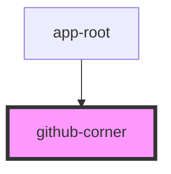

# github-corner

<!-- Auto Generated Below -->

## Properties

| Property | Attribute | Description     | Type     | Default |
| -------- | --------- | --------------- | -------- | ------- |
| `href`   | `href`    | URL to link to. | `string` | `''`    |

## Dependencies

### Used by

 - [app-root](../../app)

### Graph

----------------------------------------------

*Built with [StencilJS](https://stenciljs.com/)*
