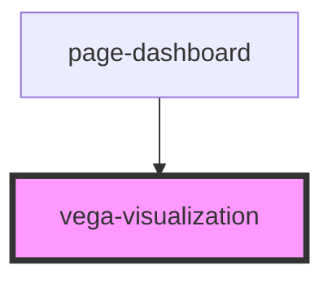

# vega-visualization

<!-- Auto Generated Below -->

## Properties

| Property  | Attribute | Description                                              | Type     | Default     |
| --------- | --------- | -------------------------------------------------------- | -------- | ----------- |
| `spacing` | `spacing` | Spacing in pixels to apply in order to fit plot exactly. | `number` | `undefined` |
| `spec`    | `spec`    | The specification of the visualization.                  | `any`    | `undefined` |

## Dependencies

### Used by

 - [page-dashboard](../../pages/dashboard)

### Graph

----------------------------------------------

*Built with [StencilJS](https://stenciljs.com/)*
