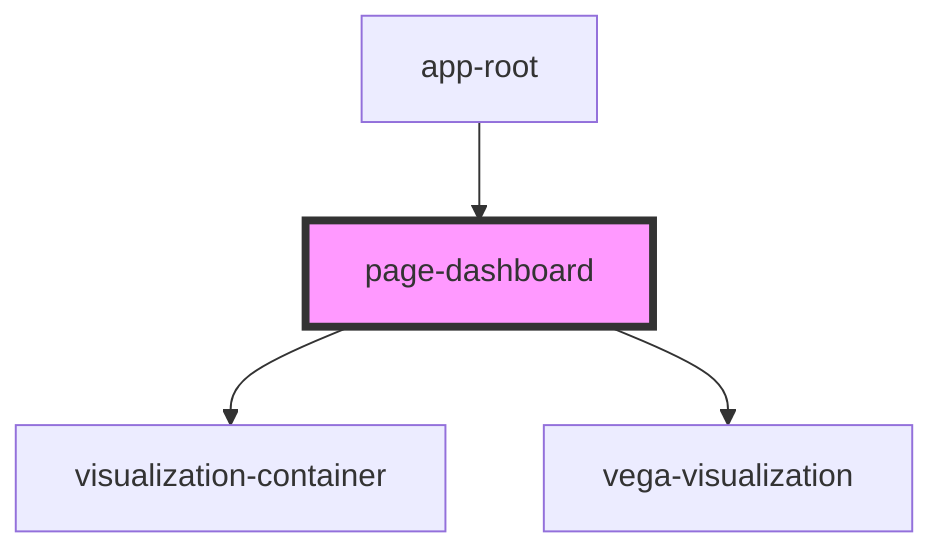

# page-dashboard

<!-- Auto Generated Below -->

## Properties

| Property           | Attribute | Description                    | Type         | Default     |
| ------------------ | --------- | ------------------------------ | ------------ | ----------- |
| `coeffs`           | --        | Wavelet coefficients.          | `number[][]` | `undefined` |
| `interpTimeSeries` | --        | Interpolated time series data. | `Point[]`    | `undefined` |
| `timeSeries`       | --        | Time series data.              | `Point[]`    | `undefined` |

## Dependencies

### Used by

 - [app-root](../../app)

### Depends on

- [visualization-container](../../components/visualization-container)
- [vega-visualization](../../components/vega-visualization)

### Graph

----------------------------------------------

*Built with [StencilJS](https://stenciljs.com/)*
